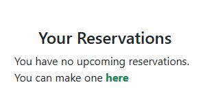

<h1 align="center">The Failte Bistro</h1>

This project was designed as a bistro website, booking tool and blog for the fictional buisness The Failte Bistro, 
based in Limerick City, Ireland. This project is intended for educational purposes only.
         
View the live project [here.](https://django-pp4-failte-bistro-dd00169a966c.herokuapp.com/)

## User Experience (UX)

-   ### Project goals  

    - The overall goal of the website is to create an attractive restaurant webpage that is alluring for the visitors that creates the desire to visit the restaurant. Visitors should be able to find all relevant contact and general information about the restaurant as well as viewing the menu. Visitors should be able to create, read, edit and delete a reservation.  Visitors can also view the menu, post a comment on a dish, love a dish by selecting the heart icon and like a comment by selecting the like icon. Visitors should be able to create, read, edit and delete a comment while also providing a admin management panel for the staff members to view and control during service of the restaurant.
  
-   ### User stories

    - User stories and features recorded and managed on [ GitHub Projects ](https://github.com/users/gbroder24/projects/4)

-   ### Design

    - I was really excited to get working on this project as I could see the final product from the very beginning. I wanted to create a website that had plenty of clean space. I wanted to keep the design quite simple on this site so as to not distract the user. The colours chosen were very specific from the beginning and manipulated the CSS for each section to carry the relevant, related colour throughout the site. I wanted to create an interactive, service-based, blog website. Once I had chosen the fonts and color scheme, the website content followed swiftly and I had great fun developing it.

      - Colour Scheme  
          - #f8f9fa Light gray for main background, booking form.
          - #198754 Dark green for the brand color and active link color.
          - #343a40 Dark background for the footer.
          - #ffc107 Gold color on hover effect on social media icons.
          - #ffffff White color for social links and copyright.
          - #fafafa Gray color for the about page items.
          - #0056b3 Darker blue on hover effect on booking submit button.
          - #333  Darker color for the card text to look like normal text.
          - #d9534f Slight red shade on hover for the heart icon.

          

          
      - Font  
          - The fonts in the theme are aimed to be simple and not to distract the user, and reinforce the idea of a modern restaurant.
      - Images  
          - The images provided were mostly taken directly from [Pexels](https://www.pexels.com/).
          - The main hero image of the bistro is to invoke the idea of a modern restaurant while promoting a clear purpose and branding.

-   ### Wireframes

    - Several wireframes were created to assist with the design however there is not an exhaustive collection of all page designs. Wireframes can be viewed [here](documentation/wireframes).

-   ### Database Schema 

    - The database design schema can be viewed [here](documentation/db_schema/entity-rel-diag.PNG). It consists of a Reservation, Dish and Comment model with a foreignKey of User that relates to the standard library Django.Contrib.Auth User model. 
    - This Entity Relationship Diagram(ERD) demonstrates how each feature interacts with each other and the connected PostgreSQL Database. Using Django's User Model, and Django AllAuth to carry out all user authentication, a user_id is created when the user registers with their username and password, email optional. This allows the user to have full CRUD functionality for reservations and comments.

    - The Dish and Comments Model was inspired by the blog walkthrough by the Code Institute during my learning of Django. It helped me to get a good and secure grasp of the templating structure and connected Python files.

    - My Booking Model collects data from the user about them which can be used by the Admin to check the reservations and allow them to be seated at their table at the allocated time. The booking form displays a dropdown menu for the number of guests and half hourly slots that are available for booking. A DateField allows that booking date to be chosen. The DateField is a validated field and will raise a validation error if the date entered is a past date. The Contact Number field is also a validated field and will display an error message if the string entered contains any characters that are not numbers.

    - Through the Admin Django Dashboard, the connected user_id to all data entered to the site means that the Admin Staff can remove a User and their data completely through the additon of on_delete=models.CASCADE.

## Project Planning  
 
-   ### Strategy Plane

    - The project goal was to build a simple booking app for a service where the user (customer) could create, read, edit and delete multiple reservations and comments thus giving a review on the food, service and their dining experience. As the service itself was uncomplicated, I aimed to create an easy, uncomplicated booking and review system for the user. Through planning and design prep work, I realised that there was an opportunity to treat this service like a 'brand' and develop the idea further. A social element was born from this with an idea for dog owners to be able to share the experience with their furry friends. This would hopefully help to create a happy group of users who would recommend the bistro to others and attract more users to sign up.

      -   #### Site Goals

          - Create a safe, happy environment for customers, dog owners.
          - Plenty of clean space to keep it fresh and to-the-point.
          - Commonly-used, identifiable icons with some redesigns to fit the theme.
          - Easy UI for quick fulfillment of feature CRUD functionalities.
          - UX remains the same whether on mobile, tablet or desktop.
          - Scalable idea, for addition of future features to easily grow the business.

-   ### Agile methodology
    - The principles of agile methodology were utilized during the project. By assigning user stories to issues and taking advantage of the GitHub Kanban board functionality, the necessary goals and priorities throughout the project could be well defined. In addition, labels were used to further define the priority of eacn user story in the Kanban board.  

      -    #### MoSCoW Prioritization

            - I chose to follow the MoSCoW Prioritization method for Failte Bistro, identifying and labelling my:

              - **Must Haves**: the 'required', critical components of the project. Completing my 'Must Haves' helped me to reach the MVP (Minimum Viable Product) for this project early, allowing me to develop the project further than originally planned.
                
              - **Should Haves**: the components that are valuable to the project but not absolutely 'vital' at the MVP stage. The 'Must Haves' must receive priority over the 'Should Haves'.
              - **Could Haves**: these are the features that are a 'bonus' to the project, it would be nice to have them in this phase, but only if the most important issues have been completed first and time allows.
              - **Won't Haves**: the features or components that either no longer fit the project's brief or are of very low priority for this release. 

-   ### Security
    - A number of security steps were taken in this project in order to protect the user's submitted data. Unlike a strictly informative website, Failte Bistro allows the user to become part of the community and avail of it's booking and commenting services. To meet the strict internet standards of protecting a user's data, the following processes were included in the project's development.

      -   #### AllAuth 

          - Django AllAuth is an installable framework that takes care of the user registration and authentication process. Authentication was needed to determine when a user was registered or unregistered and it controlled what content was accessible on Failte Bistro. The setup of AllAuth included:

            - installing it to my workspace dependencies
            - adding it to my INSTALLED_APPS in my settings.py
            - sourcing the AUTHENTICATION_BACKENDS from the AllAuth docs for my settings.py
            - adding its URL to my projects 'urls.py'
            - run database migrations to create the tables needed for AllAuth
  
      -   #### Defensive Design  

          - Failte Bistro was developed to ensure a smooth user experience, to the best of my current learning experience with Django. 

            - Input validation and error messages provide feedback to the user to guide them towards the desired outcome. 
            - Unregistered users are diverted to the Sign Up page from restricted access pages. 
            - Authentication processes control edit/delete icons to reveal them to the content author only. 
            - Deletion of data is confirmed through an additional modal, double-checking with the user.
            - Testing and validation of features completes the process.

      -   #### CSRF Tokens

          - CSRF (Cross-Site Request Forgery) tokens are included in every form to help authenticate the request with the server when the form is submitted. Absence of these tokens can leave a site vulnerable to attackers who may steal a users data.
  

## Features  

### User View - Registered/Unregistered

It was important to me from the beginning that the Failte Bistro be accessible to an unregistered user, in some capacitites. I wanted the website to sell the product to a new user quickly by immediately displaying text describing the bistros goals and inviting them to reserve a table, view the menu images, content and other users positive comments describing their experiences of the food and business. The following is a breakdown of the site's accessibility for registered/unregistered users:

| Feature   | Unregistered User | Registered, Logged-In User |
|-----------|-------------------|-----------------|
| Home Page | Visable           | Visable         |
| About Page | Visable          | Visable         |
| Menu      | Visable           | Visable         |
| Menu Detail Page | Visable           | Visable but full feature interaction not available        |
| Booking   | Icon visible but redirected to Sign In page/Sign Up through link | Visable and full feature interaction available |
| Reservation Page  | Not Visable | Visable and full feature interaction available |

### Navbar  

- The NavBar has a sleek and slimple design to easily help the user navigate around the page, with the bistro name clearly conveying to the user who the page belongs to, and emphasizing the book a table button using the color scheme.

  

 

 

 

### Footer

- The footer displays the address, contact details, opening hours and a map of the business. The footer has been created with the social-media icons, from [Font Awesome](https://fontawesome.com/), open in a new tab when clicked. Failte Bistro does not have any active social media currently so the social links only bring the user to the social platforms sign up pages for Facebook, X and Instagram. It also displays text about the Junior Full Stack Developer.

### Hero  

- The hero section serves as the main landing page for the website, providing branding with the bistros name and a clear purpose and explanation of what the main goals of the site are with links to make a reservation and view the menu.

  

### About

- The About section informs the user why they should choose the Failte Bistro for their next dining experience. It's location, family run business with plenty of experience in the hospitality sector, awards attained, the use of local ingredients in all dishes and that the premises is dog friendly.

  

  

### Menu

- The Menu page has a nice grid design with images of the dishes, displaying the title, excerpt, time and date the dish was created on or updated on and the author who posted the dish. The dishes displayed can only be posted by staff admin.

  

### Menu Detail  

- The Menu Detail page has a nice grid design with an image of the selected dish from the menu page, displaying the title of the dish, content about the dish, time and date the dish was created on or updated on and the author who posted the dish. 
- A registered user can submit a comment about the dish post and has full CRUD functionality on the comment. The author of the comment is displayed along with the time and date the comment was created on or updated on.
- The user recieves feedback messages on all stages of their CRUD process and that their comment will need approval. The delete button provides a pop up modal requiring the user confirms their request to cancel the reservation, this improves UI/UX using defensive programming. They can also like a comment by selecting the thumbs up icon and love a dish by selecting the heart icon.
- The admin can review the comment and approve or delete if they so wish.
- There is also a comment counter, heart counter and like counter displaying the current number of comments, individual comment likes, and the number of users that love a dish. 

  

  

### Reservations 

- The Reservations page shows a user's bookings with relevant information for the user, while logged in or if the user has no bookings, informs the user there are no reservations and provides a link to book a table.
- A registered user can read, edit and delete a booking and has full CRUD functionality on the reservation. The user recieves feedback messages on all stages of their CRUD process.
- The delete button provides a pop up modal requiring the user confirms their request to cancel the reservation, this improves UI/UX using defensive programming.

 

 

 

 

### Book A Table  

- When booking a table the user is presented with a clean and clear form to fill in, complete with validation, making it easy to book a table.

 

   

 

### Account Signup  

- Users are required to add their Username, Password twice and Email (optional) to ensure the correct one is saved. If any field is not filled in appropriately then a display message is used to inform the user with how to procede to complete the form. The Sign up page is created with a default template available with the AllAuth package. These templates are combined with the power of Bootstraps Crispy Forms pack to give extra control over the forms' appearance.

  

### Account Sign In  

- Users are required to add their Username and Password to ensure the correct one is saved. If any field is not filled in appropriately then a display message is used to inform the user with how to procede to complete the form. The Sign in page is created with a default template available with the AllAuth package. These templates are combined with the power of Bootstraps Crispy Forms pack to give extra control over the forms' appearance.

  

### Account Sign Out  

- A user may choose to sign out and if so will be redirected to the home page on successfull sign out.

  

### Future Features

- **Admin key icon for staff login**: A key link or icon appears in the nav bar for the Admin user that brings them directly to the admin panel without having to type it in to the browser.
- **Social account login**: Allowing popular social account login to the Failte Bistro site will speed up the registration and booking process.

## Technologies and Languages Used

- [ HTML5 ](https://developer.mozilla.org/en-US/docs/Glossary/HTML5).
- [ CSS3 ](https://www.geeksforgeeks.org/difference-between-css-and-css3/).
- [ Javascript ES6 ](https://www.w3schools.com/js/js_es6.asp).
- [ Python3 ](https://www.python.org/download/releases/3.0/). 
- [ Django ](https://www.djangoproject.com/) was used as the Python framework for the site. 
- [ MarkDown ](https://github.com/luong-komorebi/Markdown-Tutorial/blob/master/README.md) Readme.md file.  
- [ Github ](https://github.com/about) Repository.  
- [ Gitpod ](https://www.gitpod.io/about) IDE.  
- [ Git ](https://git-scm.com/about) Version control.  
- [ W3schools ](https://www.w3schools.com/) HTML, CSS, Python tips.  
- [ Cloudinary ](https://cloudinary.com/) was used for cloud media storage of staff uploaded images.
- [ ElephantSQL ](https://www.elephantsql.com/) was used to host the PostgreSQL database needed to collect and recall the users data.
- [ MarkUp Validation ](https://validator.w3.org/#validate_by_uri) to validate html code to standard.
- [ CSS Validation ](https://jigsaw.w3.org/css-validator/) to validate css code to standard.
- [ Javascript Validation ](https://jshint.com/) to validate javascript code to standard.
- [ CI Python Linter ](https://pep8ci.herokuapp.com/#) to validate code to PEP8 standard.  
- [ Heroku ](https://id.heroku.com/) to deploy the application.      

## Frameworks and Libraries Used

- asgiref==3.8.1
- cloudinary==1.36.0
- crispy-bootstrap5==0.7
- dj-database-url==0.5.0
- dj3-cloudinary-storage==0.0.6
- Django==4.2.16
- d- jango-allauth==0.57.2
- django-crispy-forms==2.3
- django-summernote==0.8.20.0
- gunicorn==20.1.0
- oauthlib==3.2.2
- pillow==11.0.0
- psycopg2==2.9.10
- PyJWT==2.9.0
- python3-openid==3.2.0
- requests-oauthlib==2.0.0
- sqlparse==0.5.1
- urllib3==1.26.20
- whitenoise==6.7.0

## Programs & Tools

- [ Google Fonts ](https://fonts.google.com/)to incorporate font styles.  
- [ Bootstrap ](https://getbootstrap.com/) to create the front-end design.
- [ Balsamiq ](https://balsamiq.com/) to create wireframes
- [ Cloud Convert ](https://cloudconvert.com/) to convert images
- [ Image Resizer ](https://imageresizer.com/) to resize images
- [ Coolers ](https://coolors.co/) to create colour palette
- [ Lucidchart ](https://www.lucidchart.com/pages/) was used to create the database schema.
 

## Testing  

Both manual and automated testing was used during the final development phase of the project. For all testing, please refer to the [TESTING.md](TESTING.md) file.

## Deployment

### Cloning and Forking

1. Download the Gitpod extension for Chrome.  
2. Once extension is installed a green Gitpod button will show up on the Github repo.  
3. Click on the green Gitpod button and it will start up the workspace.  

### Local

1. Click on the green Code button in the repo.  
2. Under the HTTPS tab clone using the web URL.  
3. Copy the URL to clipboard and paste in the browser.  

### Remote

This website was deployed using GitHub pages. The steps to deploy are as follows:

1. Login to GitHub and navigate to the repository page (body-and-mind), click on the repository.
2. Once inside the repository, click on the "Settings" tab above the repository title.
3. Under "Code and automation" select "Pages" tab on the left side navigation menu.
4. In the "Build and Deployment" section (middle of the screen), under "Source" select from the drop-down menu "Deploy 									from a branch".
5. Under "Branch", select "main" branch and then "root" folder and click "save" button
6. The GitHub page site will be deployed.

It might take a few minutes to generate the "live" website link.

The live link to the website can be found here: [ Failte Bistro ](https://django-pp4-failte-bistro-dd00169a966c.herokuapp.com/).

### Heroku Deployment

1. Navigate to your Heroku dashboard and create a new app with a unique name.  
2. Click on the Settings tab and reveal the config vars and set your environment variables:

    | Key | Value |
    | --- | --- |
    | `CLOUDINARY_URL` | insert your own Cloudinary API key here |
    | `DATABASE_URL` | insert your own ElephantSQL database URL here |
    | `DISABLE_COLLECTSTATIC` | 1 (*this is temporary, and can be removed for the final deployment*) |
    | `SECRET_KEY` | this can be any random secret key |  

    `DISABLE_COLLECTSTATIC` and a value of `1` prevents Heroku from uploading static files, such as CSS and JS, during the build.  
3. Install a production-ready webserver for Heroku `pip3 install gunicorn~=20.1`.  
Add `gunicorn==20.1.0` to the requirements.txt file with:  
`pip3 freeze --local > requirements.txt`  
Note: gunicorn is a production equivalent of the `manage.py runserver` used in development but with speed and security optimisation.  
4. Create a file named Procfile at the root directory of the project (same directory as requirements.txt).  
Note: The Procfile has no file extension.  
5. In the Procfile, declare this is a web process followed by the command to execute your Django project.  
`web: gunicorn my_project.wsgi` This assumes your project is named my_project. Note the space after the colon.  
Note: `gunicorn my_project.wsgi` is the command heroku will use to start the server. It works similarly to `python3 manage.py runserver`.
6. Open the my_project/settings.py file and replace `DEBUG=True` with `DEBUG=False`.  
Note the comment regarding security in production.  
7. Also, in settings.py we need to append the Heroku hostname to the `ALLOWED_HOSTS` list, in addition to the local host we added in the last lesson.  
`,'.herokuapp.com'`  
Note: Remember the comma and the dot before `herokuapp`.  
8. You can now git add the files you have modified, git commit them and push them to GitHub.  
9. Now return to the Heroku dashboard, and in your app, click on the Deploy tab.  
10. In the Deployment method section enable GitHub integration by clicking on Connect to GitHub.  
If you have not deployed a project from GitHub before then, you will be asked to authenticate with GitHub.  
11. Start typing your project repo name into the search box and click Search. A list of repositories from your GitHub account should appear. Click on the GitHub repo you want to deploy from.  
12. Scroll to the bottom of the page and click Deploy Branch to start a manual deployment of the main branch.  
You can view the build output in the application's Activity tab in the dashboard.  
13. Click on Open app to view your deployed project.    
14. Open the Resources tab and choose an eco dyno. This dyno is a lightweight container to run your project.  
15. Open the Resources tab and verify there is no existing Postgres database add-on. If there is one you can destroy it.  
16. Click on Open app to view your deployed project.  

### PostgreSQL

1. Navigate to PostgreSQL from Code Institute.  
2. Enter your student email address in the input field provided.  
3. Click Submit.  
4. Wait while the database is created.  
5. Your database is successfully created! Please review the email sent to your student email inbox.  
6. Return to your workspace and open the codestar/settings.py file. Change the value of `DEBUG` back to True as this will ensure that you get detailed errors to ease debugging during development.  
7. Create a file named env.py at the top level of the project. You can either create a new file in the file structure or use the terminal command as shown.  
8. Open the .gitignore file and add env.py to prevent the secret data you will add to it from being pushed to GitHub.  
Note: If you have used a codeinstitute template then it will be there already.  
9. In your newly created env.py file, import Python's operating system module and use it to set the value of the DATABASE_URL constant to the URL in the email you received from PostgreSQL from Code Institute.  
`import os`  
`os.environ.setdefault(
    "DATABASE_URL", "<your-database-URL>")`  
Note: Remember the quotes around the constant and your URL as the `setdefault()` method expects string values as parameters.  
10. Pip install the two packages required to connect to your PostgreSQL database. Then add them to the requirements file:  
pip3 install dj-database-url~=0.5 psycopg2~=2.9  
pip3 freeze --local > requirements.txt  
Note: `psycopg2` is a driver for interacting with PostgreSQL databases using Python. The `dj-database-url` Python package is a utility to connect Django to a database using a URL.  
11. In codestar/settings.py, import the appropriate packages (Note: You will use dj_database_url in a later step). Now we connect the settings.py file to the env.py file:  
`import os`  
`import dj_database_url`  
`if os.path.isfile('env.py'):`  
  `import env`  
12. Next in the settings.py file, we need to comment out the local sqlite3 database connection.  
Note: Django provides this local sqlite3 database by default for development, but we are going to go with a production-ready PostgreSQL cloud database instead.  
13. Then, in the settings.py file, connect to the environment variable DATABASE_URL you previously added to the env.py file:  
`DATABASES = {
    'default': dj_database_url.parse(os.environ.get("DATABASE_URL"))
}`  
14. Now that your project is connected to the database, you can create database tables with Django's migrate command:  
`python3 manage.py migrate`  
Note: These tables are for data generated by the existing apps built into Django.  
15. Let's enter our first data into the database. As Django comes with built-in auth and admin apps we can create a superuser with admin access to our database:  
`python3 manage.py createsuperuser`  
Choose a memorable user name, use your email address and choose a secure password.  
Note: Django will check your password security.  
16. Click on Reveal Config Vars in the Settings tab.  
17. Add a new config var with a key of DATABASE_URL and the value of the PostgreSQL from Code Institute URL.  
Note: You can copy this from your env.py file (minus the quotes) or the email you received from PostgreSQL from Code Institute.  
18. Now your deployed app is connected to your PostgreSQL cloud database.

### Cloudinary API 

Cloudinary provides a cloud hosting solution for media storage. All staff uploaded images in the Failte Bistro project are hosted here.  
1. In codestar/settings.py, ensure your `DEBUG` value is set to True.  
2. Install the Python packages required to connect to the Cloudinary API  
`pip3 install cloudinary~=1.36.0 dj3-cloudinary-storage~=0.0.6`  
`urllib3~=1.26.15`  
3. Add these package versions to the requirements.txt file.  
`pip3 freeze --local > requirements.txt`  
4. Click the provided link to sign up for Cloudinary.  
    1.  Provide your name and email address and choose a password or sign in with a social account.  
    2. If asked, How would you best describe yourself? you can click on Developer.  
    3. Depending on your chosen sign-up method, you may have to respond to an email verification.  
5. In the Cloudinary dashboard, copy the CLOUDINARY_URL.  
6. Open the env.py file and set the value of the CLOUDINARY_URL constant to the URL you copied from the Cloudinary dashboard.  
`os.environ.setdefault(
    "CLOUDINARY_URL", "<URL copied from Cloudinary in last step>")`  
Note: Remember the quotes around the constant and your URL, as the `setdefault()` method expects string values as parameters.  
7. Delete the `CLOUDINARY_URL=` from the start of the URL string, as we are using the `setdefault()` method rather than assigning the value.  
8. Open the codestar/settings.py file and add the apps to `INSTALLED_APPS`.  
Note: The `cloudinary_storage` app must be immediately after `django.contrib.staticfiles`.  
9. Open the app/models.py and import the `CloudinaryField` from the cloudinary/models.py file.  
`from cloudinary.models import CloudinaryField`  
10. Also, in the app/models.py file, add a new field to the Post model to store an image for each post.  
`featured_image = CloudinaryField('image', default='placeholder')`  
11. As we have added a new model field, we must run `makemigrations` to create a new migrations file.  
`python3 manage.py makemigrations`  
12. Now, migrate the new blog migrations file to make the changes to the database schema.  
`python3 manage.py migrate`  
13. Open the app/templates/app/index.html file and add the following `if` DTL loop within the `div` with class `image-container`.  
`

  
  
  
  
  `  

14. As the images/default.jpg is loaded from static we must load static in this index.html template.  

`  
  
`  
15. Set `DEBUG` to `False`. Git add, commit and push the code to GitHub.  
`git add .`  
`git commit -m "enable serving of image files"`  
`git push`  

## Credits

### Code
  - [ The Bear ](https://github.com/JCav23/Project4-TheBear/) project.
  - [ Tribe ](https://github.com/adamgilroy22/tribe/) project.
  - [Django Documenation](https://www.djangoproject.com/) was used to provide examples of code solutions and Django functionality.
  - [Bootstrap Documenation](https://getbootstrap.com/) was used to provide examples of Bootstrap functionality and building blocks.
  - [Code Institute walkthrough](https://codeinstitute.net/) as inspiration and code examples, the code institute walkthroughs "Hello Django" and "I Think Therefore I Blog" was used.
  - [Stack Overflow](https://stackoverflow.com/) - Dozens of different pages were used to assist during development and debuging.

### Content
  - [ The Bear ](https://github.com/JCav23/Project4-TheBear/) project.
  - [ Tribe ](https://github.com/adamgilroy22/tribe/) project.
  - [ Free Fido ](https://github.com/amylour/FreeFido_v2/) project.
  - [ Matt The Thresher ](https://matts.ie/matts-tipperary/) restaurant.
  - [ Cornstore ](https://cornstorelimerick.ie/) restaurant.

### Media
  - All images sourced on - [ Pexels ](https://www.pexels.com/)

### Acknowledgements
  - My Code Institute Mentor Rory Patrick Sheridan for feedback and suggestions.
  - My Code Institute Cohort Facilitator Lewis Dillon for project ideas and information.
  - My family, who helped keep me motivated during this challenging and fun project.

[🔼 Back to top](#user-experience-ux)
