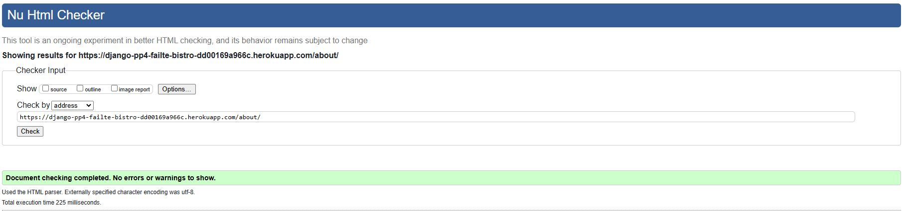
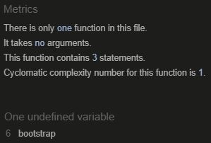
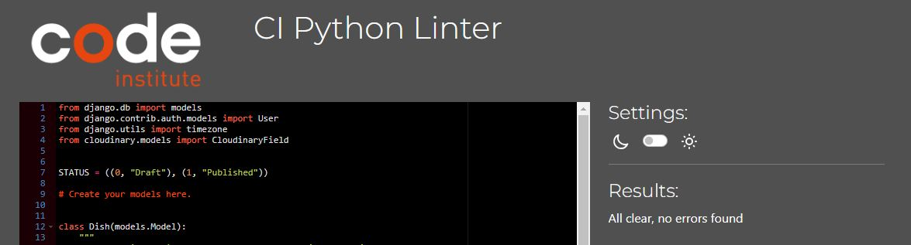
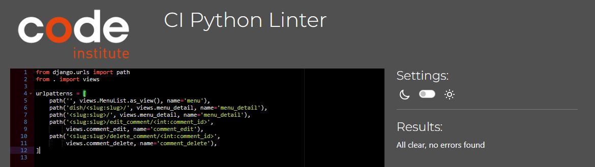
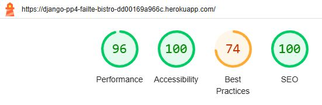
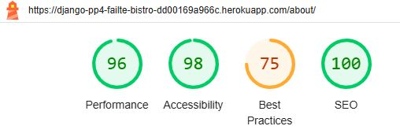
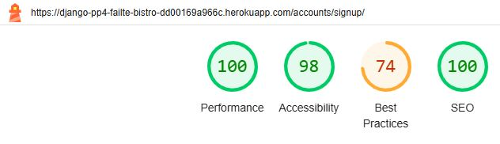

# Testing

Return back to the [README.md](README.md) file.

## Code Validation

### HTML

I have used the recommended [HTML W3C Validator](https://validator.w3.org) to validate all of my HTML files.

As my project uses Jinja syntax, such as `` and ``  
it will not validate properly if I copy and paste into the HTML validator straight from my source files.

Usually in order to properly validate these types of files, it's recommended to
[validate by uri](https://validator.w3.org/#validate_by_uri) from the deployed Heroku pages.

Some of the pages on this site require a user to be logged-in and authenticated,
and will not work using this method, due to the fact that the HTML Validator (W3C) doesn't have
access to login to the pages.

In order to properly validate my HTML pages with Jinja syntax for authenticated pages, I followed these steps:

- Navigate to the deployed pages which require authentication
- Right-click anywhere on the page, and select **View Page Source** (usually `CTRL+U` or `⌘+U` on Mac).
- This will display the entire "compiled" code, without any Jinja syntax.
- Copy everything, and use the [validate by input](https://validator.w3.org/#validate_by_input) method.
- Repeat this process for every page that requires a user to be logged-in/authenticated.

| Page | W3C URL | Screenshot | Notes |
| --- | --- | --- | --- |
| Home | [W3C](https://validator.w3.org/nu/?doc=https%3A%2F%2Fdjango-pp4-failte-bistro-dd00169a966c.herokuapp.com%2F) |  | Pass: No Errors |
| About | [W3C](https://validator.w3.org/nu/?doc=https%3A%2F%2Fdjango-pp4-failte-bistro-dd00169a966c.herokuapp.com%2Fabout%2F) |  | Pass: No Errors |
| Menu | [W3C](https://validator.w3.org/nu/?doc=https%3A%2F%2Fdjango-pp4-failte-bistro-dd00169a966c.herokuapp.com%2Fmenu%2F) |  | Pass: No Errors |
| Menu Detail | N/A |  | Pass: No Errors |
| Reservation | N/A |  | Pass: No Errors |
| Booking | N/A |  | Pass: No Errors |
| Log In | [W3C](https://validator.w3.org/nu/?doc=https%3A%2F%2Fdjango-pp4-failte-bistro-dd00169a966c.herokuapp.com%2Faccounts%2Flogin%2F) |  | Pass: No Errors |
| Log Out | [W3C](https://validator.w3.org/nu/?doc=https%3A%2F%2Fdjango-pp4-failte-bistro-dd00169a966c.herokuapp.com%2F) |  | Pass: No Errors |
| Sign Up | [W3C](https://validator.w3.org/nu/?showsource=yes&doc=https%3A%2F%2Fdjango-pp4-failte-bistro-dd00169a966c.herokuapp.com%2Faccounts%2Fsignup%2F) |  | Pass: No Errors |

### CSS

I have used the recommended [CSS Jigsaw Validator](https://jigsaw.w3.org/css-validator) to validate my CSS file.

| File | Jigsaw URL | Screenshot | Notes |
| --- | --- | --- | --- |
| style.css | N/A |  | Pass: No Errors |

### JavaScript

I have used the recommended [JShint Validator](https://jshint.com) to validate all of my JS files.

| File | Jshint URL | Screenshot |  
| --- | --- | --- |
| comments.js | N/A |  | 
| messages.js |  N/A |  | 

### Python

I have used the recommended [CI Python Linter](https://pep8ci.herokuapp.com) to validate all of my Python files.

| File | Screenshot | Notes |
| --- | --- | --- |
| admin.py (about) |  | Pass: No Errors |
| apps.py (about) |  | Pass: No Errors |
| urls.py (about) |  | Pass: No Errors |
| views.py (about) |  | Pass: No Errors |
| admin.py (booking) |  | Pass: No Errors |
| apps.py (booking) |  | Pass: No Errors |
| forms.py (booking) |  | Pass: No Errors |
| models.py (booking) |  | Pass: No Errors |
| test_apps.py (booking) |  | Pass: No Errors |
| test_forms.py (booking) |  | Pass: No Errors |
| test_views.py (booking) |  | Pass: No Errors |
| urls.py (booking) |  | Pass: No Errors |
| views.py (booking) |  | Pass: No Errors |
| apps.py (home) |  | Pass: No Errors |
| urls.py (home) |  | Pass: No Errors |
| views.py (home) |  | Pass: No Errors |
| admin.py (menu) |  | Pass: No Errors |
| apps.py (menu) |  | Pass: No Errors |
| forms.py (menu) |  | Pass: No Errors |
| models.py (menu) |  | Pass: No Errors |
| test_apps.py (menu) |  | Pass: No Errors |
| test_forms.py (menu) |  | Pass: No Errors |
| test_views.py (menu) |  | Pass: No Errors |
| urls.py (menu) |  | Pass: No Errors |
| views.py (menu) |  | Pass: No Errors |

## Browser Compatibility

I've tested my deployed project on multiple browsers to check for compatibility issues.

| Browser | Screenshot | Notes |
| --- | --- | --- |
| Chrome |    | Works as expected |
| Edge |    | Works as expected |

## Responsiveness

I've tested my deployed project on multiple devices to check for responsiveness issues.

| Device | Screenshot | Notes |
| --- | --- | --- |
| Mobile (DevTools) |  | Works as expected |
| Tablet (DevTools) |  | Works as expected |
| Laptop |  | Works as expected |
| Desktop |  | Works as expected |

## Lighthouse Audit

I've tested my deployed project using the Lighthouse Audit tool to check for any major issues.

| Page | Size | Screenshot | Notes |
| --- | --- | --- | --- |
| Home | Desktop |  | Some minor warnings |
| Home | Mobile |  | Some minor warnings |
| About | Desktop |  | Some minor warnings |
| About | Mobile |  | Some minor warnings |
| Menu | Desktop |  | Some minor warnings |
| Menu | Mobile |  | Some minor warnings |
| Menu Detail | Desktop |  | Some minor warnings |
| Menu Detail | Mobile |  | Some minor warnings |
| Reservation | Desktop |  | Some minor warnings |
| Reservation | Mobile |  | Some minor warnings |
| Booking | Desktop |  | Some minor warnings |
| Booking | Mobile |  | Some minor warnings |
| Sign Up | Desktop |  | Some minor warnings |
| Sign Up | Mobile |  | Some minor warnings |
| Sign In | Desktop |  | Some minor warnings |
| Sign In | Mobile |  | Some minor warnings |
| Sign Out | Desktop |  | Some minor warnings |
| Sign Out | Mobile |  | Some minor warnings |

## Manual Testing

| Page | Test | Outcome |
| -- | -- | -- |
| Nav Bar | All Nav Bar Links directs to correct page when clicked | Pass |
| Footer | All social links direct to corresponding site when clicked | Pass |
| Footer | All social links open in new tab | Pass |
| Home | When user is not authenticated when booking a table they are directed to sign in page or sign up page via a sign up link | Pass |
| Home | When user is authenticated when booking a table they are directed to the booking form. | Pass |
| Menu | When user is authenticated they can click on a menu dish and are directed to the menu detail page | Pass |
| Menu | When user is not authenticated they can click on a menu dish and are directed to the menu detail page | Pass |
| Menu Detail | When user is not authenticated they can not love a menu dish on the menu detail page and the heart counter remains unchanged | Pass |
| Menu Detail | When user is not authenticated they can not like a comment on the menu detail page and the like counter remains unchanged | Pass |
| Menu Detail | When user is not authenticated they must login or sign up to leave a comment on the menu detail page | Pass |
| Menu Detail | When user is not authenticated they must login or sign up to create, edit and or delete their own comment(s) on the menu detail page | Pass |
| Menu Detail | When user is authenticated they can create, edit and or delete their own comment(s) on the menu detail page | Pass |
| Menu Detail | When user is authenticated and they create their own comment(s) on the menu detail page the comment counter value increments | Pass |
| Menu Detail | Comment delete modal asks for confirmation before deletion | Pass |
| Menu Detail | When user is authenticated and they delete their own comment(s) on the menu detail page the comment counter value decreases | Pass |
| Menu Detail | When user is authenticated and they edit their own comment(s) on the menu detail page the comment counter value is unchanged | Pass |
| Menu Detail | When user is authenticated they can love a menu dish on the menu detail page and the heart counter value increments | Pass |
| Menu Detail | When user is authenticated they can unlove a menu dish on the menu detail page and the heart counter value decreases | Pass |
| Menu Detail | When user is authenticated they can like a comment on the menu detail page and the like counter value increments | Pass |
| Menu Detail | When user is authenticated they can unlike a comment on the menu detail page and the like counter value decreases | Pass |
| Reservations | When user is not authenticated they can not view the reservations page | Pass |
| Reservations | When user is authenticated they can view the reservations page | Pass |
| Reservations | When user is authenticated they can create, read, edit and delete reservations | Pass |
| Reservations | Reservation modal asks for confirmation before deletion | Pass |
| Authentication | User can create an account | Pass |
| Authentication | User can login to their account | Pass |
| Authentication | User can logout to their account | Pass |
| Authentication | Admin has has more privileges than a User | Pass |
| Authentication | Admin can post to the menu detail page. A user can not. | Pass |
| Authentication | Admin can delete post to the menu detail page. A user can not. | Pass |
| Authentication | Admin can review and approve comments on the menu detail page. A user can not. | Pass |
| Authentication | Admin can review and delete comments on the menu detail page. A user can not. | Pass |
| Comment Form | Form wont submit with empty content field | Pass |
| Reservation Form | Form wont submit with empty any fields | Pass |
| Reservation Form | Form wont submit with any non number characters in the contact number field | Pass |
|Reservation Form| Form does not let you book in the past | Pass |
|Reservation Form | Validation wont accept two identical bookings | Pass |

## Automated Testing

I have conducted a series of automated tests on my application. In total there are twenty tests.

### Python (Unit Testing)

I have used Django's built-in unit testing framework to test the application functionality.

In order to run the tests, I ran the following command in the terminal:

`python3 manage.py test`

## Bugs

**Fixed Bugs**

When submitting the reservation form the user / admin received a feedback message informing them of an invalid data type submission. On review of the reservation model, the GUESTS tuple had strings in the tuples and these were assigned to choices in the integer field of the number of guests. To resolve this error integers were coded instead of strings in the GUESTS tuple of tuples.

**Open Issues**

## Unfixed Bugs

There is a known bug in the menu list page. When there are three dishes in the starters row and admin posts a fourth dish, this new post pushes an earlier post to the next row and it takes up the entirety of the new row making it larger than the other posts.
This bug may be propagated to the main and desserts rows.

There is a known bug in the menu list page. In the menu_list.html file the three for loop counters are not all divisable by three. To get all the posts displaying in a row. Different values were used for the for loops.

[ Back To Top ](#testing)